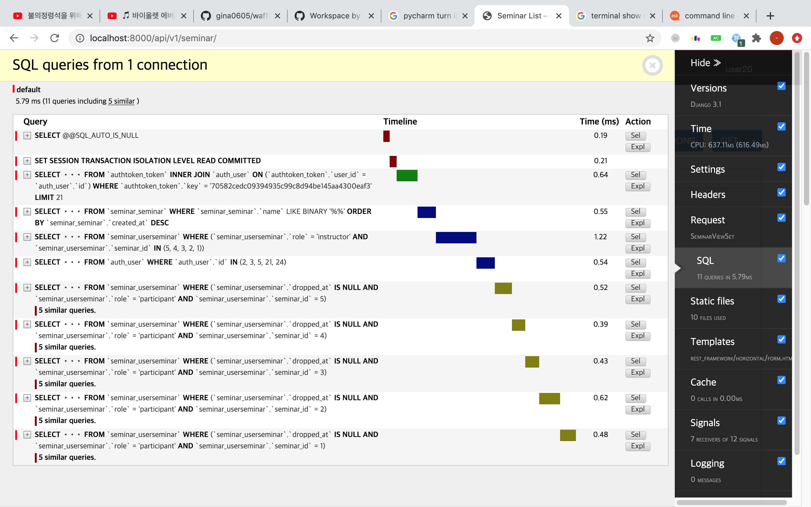

# `GET /api/v1/user/seminar/` 최적화
`GET /api/v1/user/seminar/`에서 DB에 날리는 query를 줄이기 위해 `prefetch_related`, `annotate`를 이용했습니다.

## optimize 전
seminar/views.py
```python
class SeminarViewSet(viewsets.GenericViewSet):
    def list(self, request):
        #...
        seminars = self.get_queryset().filter(name__contains=name)
        #...
```
seminar/serializers.py
```python
class SimpleSeminarSerializer(serializers.ModelSerializer):
    def get_instructors(self, seminar):
        queryset = UserSeminar.objects.filter(seminar=seminar, role='instructor')
        return SeminarInstructorSerializer(queryset, many=True).data
    
    def get_participant_count(self, seminar):
        return UserSeminar.objects.filter(
            seminar=seminar,
            role='participant',
            dropped_at=None,
        ).count()
```


## `prefetch_related` 적용 후
seminar/views.py
```python
class SeminarViewSet(viewsets.GenericViewSet):
    def list(self, request):
        #...
        seminars = self.get_queryset()\
            .filter(name__contains=name)\
            .prefetch_related(
                Prefetch(
                    'user_seminar',
                    queryset=UserSeminar.objects.filter(role='instructor'),
                    to_attr='userseminar_instructors'
                )
            ).prefetch_related('userseminar_instructors__user')
        #...
```
seminar/serializers.py
```python
class SimpleSeminarSerializer(serializers.ModelSerializer):
    def get_instructors(self, seminar):
        return SeminarInstructorSerializer(seminar.userseminar_instructors, many=True).data
    
    def get_participant_count(self, seminar):
        return UserSeminar.objects.filter(
            seminar=seminar,
            role='participant',
            dropped_at=None,
        ).count()
```


## `annotate` 적용 후
seminar/views.py
```python
class SeminarViewSet(viewsets.GenericViewSet):
    def list(self, request):
        #...
        seminars = self.get_queryset()\
            .filter(name__contains=name)\
            .prefetch_related(
                Prefetch(
                    'user_seminar',
                    queryset=UserSeminar.objects.filter(role='instructor'),
                    to_attr='userseminar_instructors'
                )
            ).prefetch_related('userseminar_instructors__user')
        seminars = seminars.annotate(
            participant_count=Count(
                'user_seminar',
                filter=Q(user_seminar__role='participant') & Q(user_seminar__dropped_at=None)
            )
        )
        #...
```
seminar/serializers.py
```python
class SimpleSeminarSerializer(serializers.ModelSerializer):
    def get_instructors(self, seminar):
        return SeminarInstructorSerializer(seminar.userseminar_instructors, many=True).data
    
    def get_participant_count(self, seminar):
        return seminar.participant_count
```


---

DB에 날리는 query를 최적화함에 따라 걸린 시간이 13.75ms -> 5.79ms -> 3.47ms로 줄어들었습니다.   
seminar의 개수가 40개 정도로 많으면, 걸리는 시간이 체감될 정도로 짧아집니다.

